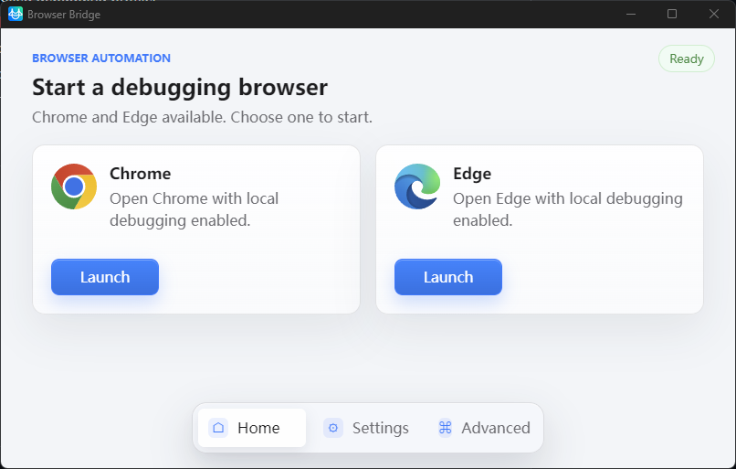
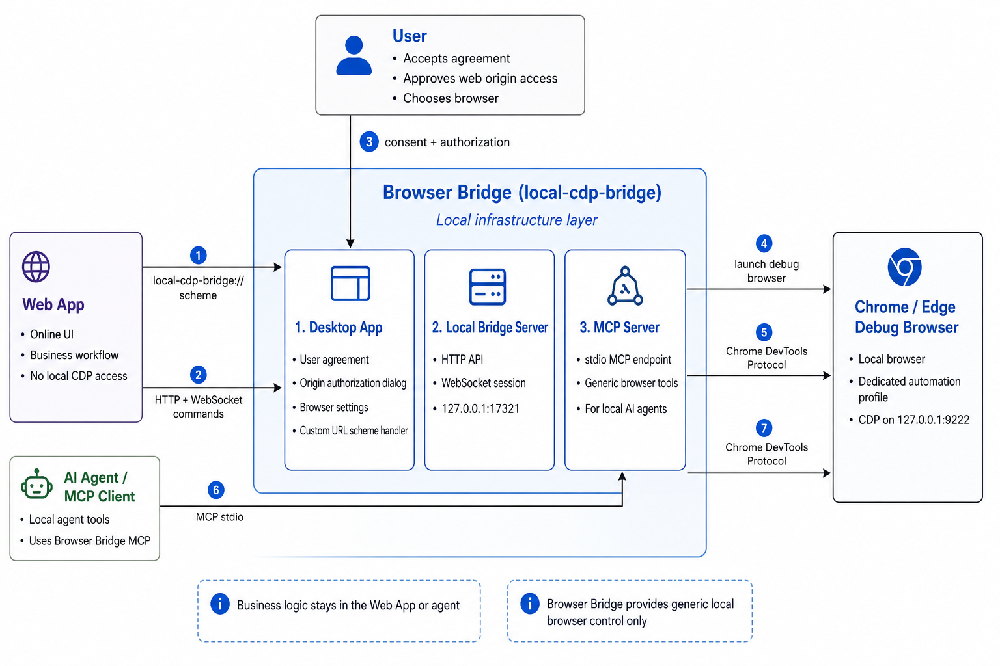

# local-cdp-bridge

`local-cdp-bridge` is a local desktop bridge that lets a web application connect to a user-authorized Chrome or Edge debugging session on the user's own computer.

It is infrastructure, not a business automation product. It does not include platform-specific publishing, scraping, messaging, payment, or account workflows.



## Goals

- Provide a non-technical-user-friendly desktop app for Windows and macOS.
- Launch Chrome or Edge with a controlled debugging profile.
- Expose a local HTTP/WebSocket bridge on `127.0.0.1`.
- Require user consent before any automation can run.
- Require explicit local authorization for web origins.
- Provide generic browser actions such as open page, click, fill, upload, read visible text, and screenshot.

## Architecture



## Default Ports

- Bridge HTTP/WebSocket: `17321`
- Bridge fallback range: `17322-17329`
- Browser CDP: `9222`
- Browser CDP fallback range: `9223-9230`

## URL Scheme

Open the bridge:

```text
local-cdp-bridge://open
```

Start a debug browser:

```text
local-cdp-bridge://start-browser?browser=chrome
```

Connect a web control session:

```text
local-cdp-bridge://connect?origin=https%3A%2F%2Fexample.com
```

Browser debug launch uses `about:blank` by default. `profileDir` is optional; if omitted, the bridge uses its managed default profile.

## MCP

The project also includes a local MCP stdio server for agent tools that need generic browser control on the user's machine. It connects to the same local Chrome or Edge debugging session and exposes a small set of browser tools over JSON-RPC stdio.

```bash
local-cdp-bridge-mcp --cdp-url http://127.0.0.1:9222
```

Available MCP tools:

- `browser_status`
- `pages_open`
- `pages_screenshot`
- `dom_text`
- `dom_click`
- `dom_fill`
- `files_upload`

The MCP server is generic infrastructure. It does not contain website-specific publishing, scraping, messaging, payment, or account workflows.

See [docs/mcp.md](docs/mcp.md).

## Web Integration

See [docs/web-api.md](docs/web-api.md) for scheme parameters, HTTP endpoints, WebSocket commands, timeout guidance, and user-visible logging recommendations.

## Web Demo

A minimal browser-side demo is available in [examples/web-demo](examples/web-demo).

It demonstrates:

- probing `/health`
- launching `local-cdp-bridge://open`
- launching `local-cdp-bridge://start-browser?browser=chrome`
- opening a WebSocket session
- sending a `pages.open` command

## Security Model

- The custom URL scheme only launches the app. It does not grant browser control.
- The user must accept the local user agreement before automation is enabled.
- Each web origin must be authorized locally.
- Browser control is limited to declared allowed origins.
- Cookies, tokens, local storage, and full page HTML are not exposed by default.

See [docs/security.md](docs/security.md).

## Development

```bash
npm install
npm run typecheck
npm run build
```

Run the development CLI:

```bash
npm run dev
```

## GitHub Repository

The default branch is `main`.

Release builds should be published through GitHub Releases. The intended release flow is:

```text
push tag vX.Y.Z
  |
  v
GitHub Actions builds Windows and macOS installers
  |
  v
GitHub Release attaches installer artifacts
```

Planned installer artifacts:

- Windows x64: `local-cdp-bridge-vX.Y.Z-windows-x64.exe` or `local-cdp-bridge-vX.Y.Z-windows-x64.msi`
- macOS universal: `local-cdp-bridge-vX.Y.Z-macos-universal.dmg`

See [docs/desktop-app.md](docs/desktop-app.md) for packaging notes.
See [docs/release-checklist.md](docs/release-checklist.md) before publishing a GitHub Release.

## License

Apache-2.0
